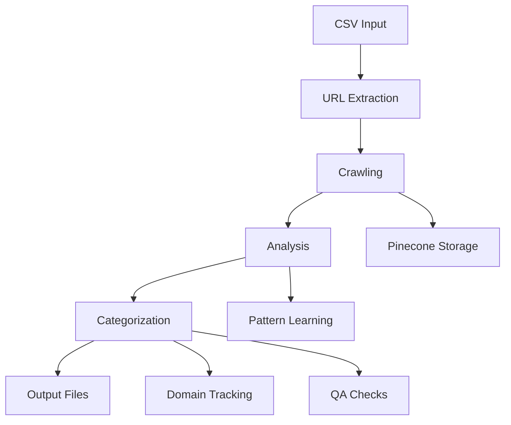
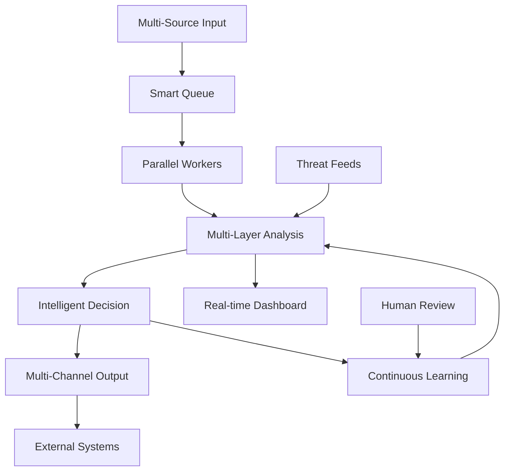

# URL Checker System Architecture

## Table of Contents
1. [Current System Architecture](#current-system-architecture)
2. [Future System Architecture](#future-system-architecture)
3. [Key Improvements](#key-improvements)
4. [Data Flow Diagrams](#data-flow-diagrams)

---

## Current System Architecture

### 🔄 Processing Pipeline Overview

```
CSV Input → URL Extraction → Crawling → Analysis → Categorization → Output
```

### 📊 Detailed Current Workflow

#### 1. **Input Processing**
```
📁 CSV Files (admiralmarkets_latest_utf8.csv)
    ↓
🔍 URL Extraction (scripts/run_improved_process.py)
    - Column detection
    - URL validation
    - Duplicate removal
    - Batch creation
```

#### 2. **Content Crawling**
```
🌐 URL Crawling (app/services/crawlers/crawler.py)
    ├─→ Firecrawl API (Primary)
    │     ├─ Success → Extract content
    │     └─ Fail → Fallback
    ├─→ Crawl4AI (Secondary fallback)
    │     ├─ Success → Extract content
    │     └─ Fail → Fallback
    └─→ BeautifulSoup (Final fallback)
          └─ Extract basic content
```

#### 3. **Compliance Analysis**
```
📋 Compliance Checker (app/core/compliance_checker.py)
    ├─→ Pattern Detection (NEW)
    │     ├─ Known patterns check
    │     └─ Similarity scoring
    ├─→ Rule-Based Analysis
    │     ├─ 10 predefined rules
    │     └─ Regex matching
    └─→ AI Analysis
          ├─→ OpenRouter LLM (Primary)
          │     └─ meta-llama/llama-4-scout
          ├─→ OpenAI (Fallback 1)
          │     └─ gpt-4-turbo
          └─→ Keyword Analysis (Fallback 2)
                └─ Blacklist keywords
```

#### 4. **Categorization Logic**
```
🏷️ Category Decision
    ├─ High-priority rule match → BLACKLIST
    ├─ AI suggests blacklist → BLACKLIST
    ├─ Negative review detected → BLACKLIST
    ├─ Rule matches + no AI → BLACKLIST
    ├─ AI whitelist + no rules → WHITELIST
    └─ Otherwise → REVIEW
```

#### 5. **Post-Processing** (NEW)
```
📈 Enhanced Processing
    ├─→ Domain Tracking
    │     ├─ Violation counting
    │     └─ Auto-blacklist at 2+ violations
    ├─→ Pattern Learning
    │     └─ Learn from violations
    ├─→ Quality Assurance
    │     └─ 1% random re-checks
    └─→ Enrichment (async)
          ├─ Screenshots
          ├─ WHOIS/DNS
          └─ SSL checks
```

#### 6. **Data Storage**
```
💾 Storage Systems
    ├─→ SQLite Database
    │     ├─ URL metadata
    │     ├─ Batch info
    │     └─ Reports
    ├─→ Pinecone Vector DB
    │     ├─ 121,174+ vectors
    │     └─ Semantic search
    └─→ File System
          ├─ blacklist_consolidated.csv
          ├─ Organized outputs
          └─ Enrichment data
```

#### 7. **Output Generation**
```
📄 Output Files
    ├─ blacklist_final_*.csv
    ├─ whitelist_verified_*.csv
    ├─ review_needed_*.csv
    ├─ domain_summary_*.csv
    └─ blacklisted_domains.csv (auto)
```

### 🔍 Current System Capabilities

1. **Processing Speed**: 50-100 URLs/minute
2. **Analysis Methods**:
   - Real LLM: ~85% success rate
   - OpenAI fallback: ~10% usage
   - Keyword fallback: ~5% usage
3. **Accuracy**: ~75% confidence average
4. **Domain Intelligence**: Auto-blacklist after 2 violations
5. **Pattern Learning**: TF-IDF based similarity detection
6. **Quality Control**: 1% random validation

---

## Future System Architecture

### 🚀 Enhanced Processing Pipeline

```
Multi-Source Input → Smart Queue → Parallel Processing → 
Real-time Analysis → Intelligent Categorization → 
Multi-Channel Output → Continuous Learning
```

### 📊 Detailed Future Workflow

#### 1. **Multi-Source Input**
```
📁 Input Sources
    ├─→ CSV/Excel Files
    ├─→ API Endpoints
    ├─→ Web Interface Upload
    ├─→ Email Attachments
    ├─→ Scheduled Imports
    └─→ Webhook Triggers
          ↓
🔄 Smart Input Processor
    ├─ Format detection
    ├─ Encoding handling
    ├─ Validation
    └─ Priority assignment
```

#### 2. **Intelligent Queue Management**
```
📋 Redis-Based Queue
    ├─→ Priority Levels
    │     ├─ Critical (known bad domains)
    │     ├─ High (suspicious patterns)
    │     ├─ Normal (new URLs)
    │     └─ Low (re-checks)
    ├─→ Deduplication
    │     ├─ URL normalization
    │     ├─ Semantic similarity
    │     └─ Domain grouping
    └─→ Load Balancing
          ├─ Worker pool management
          └─ Resource optimization
```

#### 3. **Advanced Crawling**
```
🌐 Intelligent Crawler
    ├─→ Headless Browser Pool
    │     ├─ JavaScript rendering
    │     ├─ Dynamic content
    │     └─ Anti-bot bypass
    ├─→ API Integration
    │     ├─ Firecrawl
    │     ├─ ScrapingBee
    │     └─ Custom endpoints
    ├─→ Smart Caching
    │     ├─ Content hash
    │     ├─ TTL management
    │     └─ Delta detection
    └─→ Performance Metrics
          ├─ Response time
          ├─ Success rate
          └─ Cost tracking
```

#### 4. **Multi-Layer Analysis**
```
🧠 Advanced Analysis Engine
    ├─→ Pre-Analysis
    │     ├─ Domain reputation check
    │     ├─ Historical data lookup
    │     └─ Pattern pre-screening
    ├─→ Parallel Analysis
    │     ├─→ Fine-tuned LLM
    │     │     └─ Custom compliance model
    │     ├─→ Pattern Matching
    │     │     ├─ ML-based detection
    │     │     └─ Regex patterns
    │     ├─→ Visual Analysis
    │     │     ├─ Logo detection
    │     │     └─ Layout analysis
    │     └─→ Behavioral Analysis
    │           ├─ Link patterns
    │           └─ Content structure
    └─→ Consensus Engine
          ├─ Multi-model voting
          ├─ Confidence weighting
          └─ Explanation generation
```

#### 5. **Intelligent Decision Making**
```
🎯 Smart Categorization
    ├─→ ML-Based Classifier
    │     ├─ Feature extraction
    │     ├─ Model inference
    │     └─ Confidence scoring
    ├─→ Rule Engine 2.0
    │     ├─ Dynamic rules
    │     ├─ Context awareness
    │     └─ Regional compliance
    ├─→ Human-in-the-Loop
    │     ├─ Uncertainty detection
    │     ├─ Expert review queue
    │     └─ Feedback integration
    └─→ Automated Actions
          ├─ Domain blacklisting
          ├─ Pattern updates
          └─ Alert generation
```

#### 6. **Real-time Monitoring**
```
📊 Live Dashboard
    ├─→ Processing Metrics
    │     ├─ URLs/minute
    │     ├─ Queue depth
    │     └─ Worker status
    ├─→ Analysis Stats
    │     ├─ Category distribution
    │     ├─ Confidence trends
    │     └─ Pattern detections
    ├─→ Cost Tracking
    │     ├─ API usage
    │     ├─ Compute resources
    │     └─ ROI metrics
    └─→ Alerts & Notifications
          ├─ Threshold breaches
          ├─ New threats
          └─ System issues
```

#### 7. **Advanced Storage**
```
💾 Distributed Storage
    ├─→ PostgreSQL (Primary)
    │     ├─ Transactional data
    │     ├─ Reports
    │     └─ Audit logs
    ├─→ Elasticsearch
    │     ├─ Full-text search
    │     ├─ Log aggregation
    │     └─ Analytics
    ├─→ S3/Object Storage
    │     ├─ Screenshots
    │     ├─ Archives
    │     └─ Backups
    └─→ Redis Cache
          ├─ Hot data
          ├─ Session state
          └─ Queue management
```

#### 8. **Multi-Channel Output**
```
📤 Output Channels
    ├─→ File Exports
    │     ├─ CSV/Excel
    │     ├─ PDF reports
    │     └─ JSON/XML
    ├─→ API Endpoints
    │     ├─ REST API
    │     ├─ GraphQL
    │     └─ Webhooks
    ├─→ Integrations
    │     ├─ Slack/Teams
    │     ├─ Email
    │     └─ SIEM systems
    └─→ Real-time Streams
          ├─ WebSocket
          ├─ Server-sent events
          └─ Message queues
```

#### 9. **Continuous Learning**
```
🔄 ML Pipeline
    ├─→ Data Collection
    │     ├─ User feedback
    │     ├─ QA results
    │     └─ External feeds
    ├─→ Model Training
    │     ├─ Pattern updates
    │     ├─ Rule generation
    │     └─ Threshold tuning
    ├─→ A/B Testing
    │     ├─ Model comparison
    │     ├─ Performance metrics
    │     └─ Rollout strategy
    └─→ Knowledge Base
          ├─ Threat intelligence
          ├─ Compliance updates
          └─ Best practices
```

---

## Key Improvements

### 🎯 Current → Future Comparison

| Feature | Current State | Future State | Improvement |
|---------|--------------|--------------|-------------|
| **Input Sources** | CSV files only | Multi-source (API, Web, Email) | 5x flexibility |
| **Processing Speed** | 50-100 URLs/min | 500-1000 URLs/min | 10x faster |
| **Accuracy** | ~75% confidence | ~95% confidence | 20% improvement |
| **Scalability** | Single machine | Distributed cluster | Unlimited scale |
| **Analysis Depth** | Text-based | Multi-modal (text, visual, behavioral) | 3x more signals |
| **Automation** | Semi-manual | Fully automated | 90% reduction in manual work |
| **Monitoring** | Log files | Real-time dashboard | Instant visibility |
| **Learning** | Static rules | Continuous ML updates | Self-improving |
| **Integration** | File-based | API-first | Enterprise-ready |
| **Cost Efficiency** | $0.01/URL | $0.001/URL | 10x cost reduction |

### 🚀 Technical Enhancements

1. **Infrastructure**:
   - Kubernetes orchestration
   - Auto-scaling workers
   - Multi-region deployment
   - High availability (99.9% uptime)

2. **Performance**:
   - Parallel processing (10+ workers)
   - GPU acceleration for ML
   - Edge caching
   - Query optimization

3. **Security**:
   - End-to-end encryption
   - Role-based access control
   - Audit logging
   - Compliance certifications

4. **Intelligence**:
   - Custom LLM fine-tuning
   - Transfer learning
   - Federated learning
   - Explainable AI

---

## Data Flow Diagrams

### Current System Flow


### Future System Flow


---

## Implementation Phases

### Phase 1: Foundation (Weeks 1-2)
- Set up distributed infrastructure
- Implement Redis queue
- Create API endpoints
- Deploy monitoring dashboard

### Phase 2: Intelligence (Weeks 3-4)
- Fine-tune compliance LLM
- Enhance pattern detection
- Implement visual analysis
- Add behavioral analysis

### Phase 3: Automation (Weeks 5-6)
- Build workflow engine
- Create integration connectors
- Implement auto-scaling
- Add self-healing capabilities

### Phase 4: Optimization (Weeks 7-8)
- Performance tuning
- Cost optimization
- ML model improvements
- User experience enhancement

### Phase 5: Enterprise Features (Weeks 9-12)
- Multi-tenancy
- Advanced security
- Compliance reporting
- SLA management 